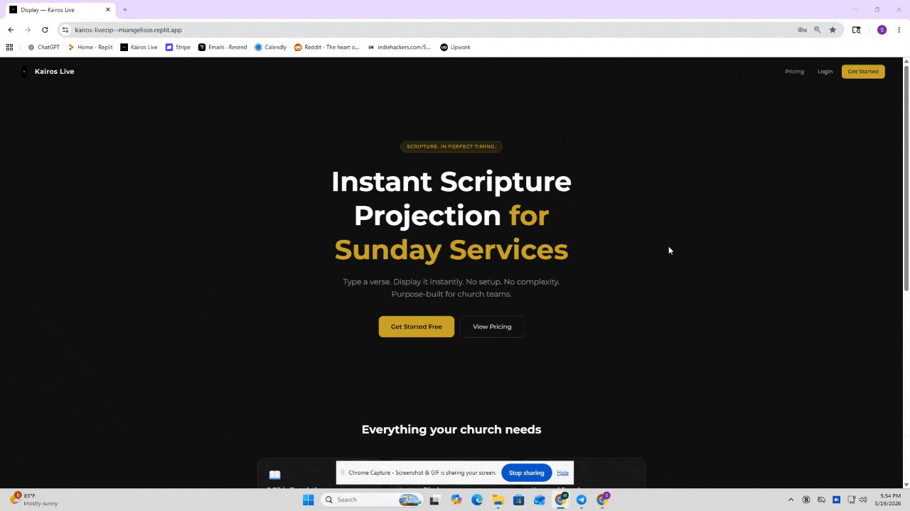

# ⛪ Kairos Live

## ⚡ Real-Time Church Service Operating System

---

## 🌸 Overview

Kairos Live is a **real-time SaaS platform for running church services smoothly and in sync**.

It replaces disconnected tools like PowerPoint and slide files with a single live system for:

- scripture display 📖  
- sermon control 🎤  
- multi-screen synchronization 🖥️  
- real-time service flow management ⚡  

---

## 🎬 Live Product Demo

### 🔐 1. Authentication & Verse Selection

Users securely log in and select Bible verses to display instantly on service screens.

---

### 🎛️ 2. Live Sermon Control System

Control the entire Sunday service in real time:

- switch slides instantly  
- manage sermon flow  
- update displays across all screens  
- coordinate live service execution  

---

### 📖 3. Sermon Creation Workflow

Create structured sermon flows:

- build service order  
- add verses and slides  
- organize live presentation sequence  
- prepare for Sunday execution  

---

## ⚡ What Makes Kairos Live Different

Unlike traditional church presentation tools:

- everything updates in real time ⚡  
- all screens stay perfectly synchronized 🖥️  
- there is a single source of truth 🧠  
- designed for non-technical volunteers 👥  

---

## 🧠 Core Architecture

Kairos Live is built as a **server-authoritative real-time system**:

- Backend controls all state  
- Clients only render updates  
- SSE streams push live changes instantly  
- No polling or manual refresh required  

---

## 🧩 Key Capabilities

- 📡 Real-time sermon updates  
- 🖥️ Multi-device synchronization  
- 📱 Remote control from mobile or laptop  
- 🔐 Role-based access (Admin / User / Owner)  
- 💳 SaaS subscription model  
- 🌍 Multi-church support (multi-tenant system)  

---

## 🚀 Product Vision

Kairos Live is designed to be:

> “The operating system for modern church services.”

Simple enough for volunteers.  
Powerful enough for real-time live production.

---

## 🏁 Status

- 🟡 Pre-deployment system  
- 🟢 Fully functional prototype  
- 🔜 Preparing for production launch  

---
