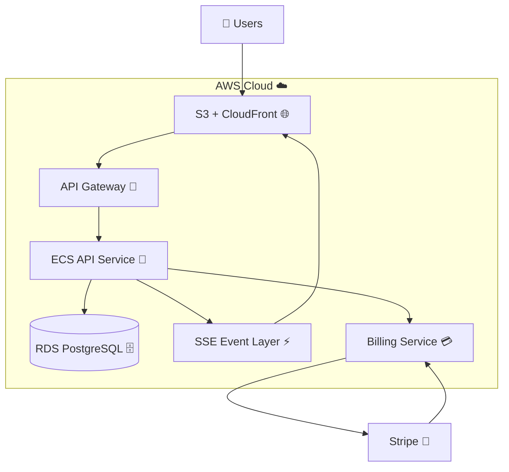
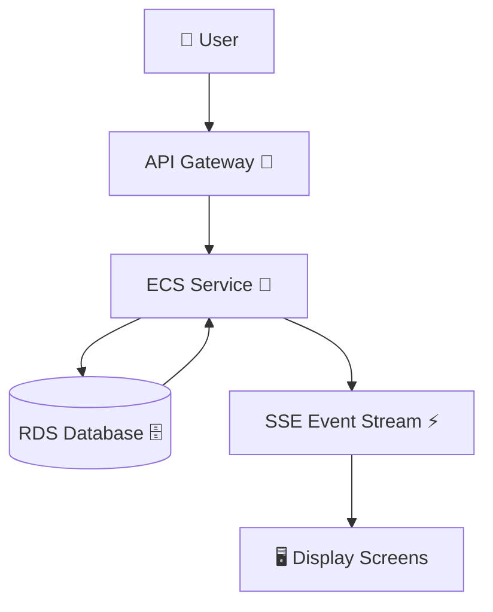
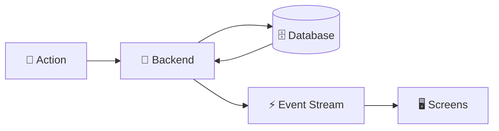
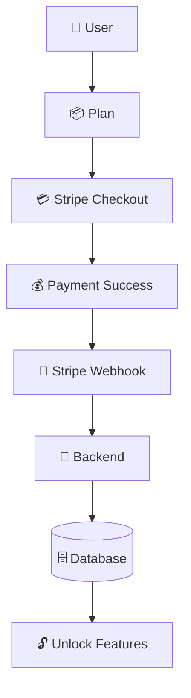

# 🧠 Kairos Live — Cloud Architecture (AWS-Style) ☁️✨

---

## 📊 System Overview 🌸

Kairos Live is a **multi-tenant real-time SaaS platform** for running synchronized church services.

It follows a **cloud-native, event-driven architecture**, where:

💡 The backend controls everything  
⚡ Events update all screens instantly  
🏢 Each church is fully isolated  
💳 Billing is handled via Stripe  

Think of it as:
> “One service → many screens → perfect real-time sync ✨”

---

## ☁️ High-Level Cloud Architecture (AWS Mapping)

---

## 🧩 AWS Service Mapping 🪄

| ✨ Kairos Component | ☁️ AWS Equivalent |
|-------------------|-------------------|
| Frontend UI | S3 + CloudFront |
| API Routing | API Gateway |
| Backend Server | ECS / EC2 |
| Database | RDS PostgreSQL |
| Real-Time System | SSE / EventBridge |
| Payments | Stripe (external 💳) |

---

## ⚙️ Core Backend Services 🧠

### 🚀 API Service (ECS / EC2)
The “brain” of Kairos Live 🧠

Handles:
- Sermon flow control 📖  
- Authentication (JWT + RBAC) 🔐  
- Multi-tenant isolation 🏢  
- State validation ⚙️  
- Subscription enforcement 💳  

---

### 🗄️ Database (RDS PostgreSQL)
The system’s memory 🧠✨

Stores:
- Users 👤  
- Churches 🏢  
- Sermons 📖  
- Slides + verses 📜  
- Subscription state 💳  

All data is safely separated using `church_id` 🔒

---

### 📡 Real-Time Event System (SSE) ⚡

Kairos Live is powered by instant live updates:

- Backend sends events  
- Clients listen in real time  
- No refreshing, no polling  
- Everything stays perfectly synced ✨  

Event types:
- `verse_update` 📖  
- `slide_update` 🎞️  
- `service_state` 🎛️  
- `service_control` 🎚️  

---

### 🖥️ Frontend Layer (S3 + CloudFront)
The “visual layer” 👀✨

- Admin Dashboard → controls everything 🧑‍💼  
- Remote Controller → live navigation 🎮  
- Display Screen → fullscreen projection 🖥️  

Frontends are **fully stateless** — they only reflect backend truth.

---

## 🔄 Cloud Runtime Execution Flow ⚡

### 💡 What happens here
1. User clicks something 🎛️  
2. API receives request 🚪  
3. Backend processes it 🧠  
4. Database updates 🗄️  
5. Event fires instantly ⚡  
6. All screens update together ✨  

---

## 📡 Real-Time Architecture Model 💫

### 💡 Simple idea:
- You trigger something 🎛️  
- Backend updates state 🧠  
- Event is broadcast ⚡  
- Everything updates instantly ✨  

---

## 🏢 Multi-Tenant SaaS Architecture 🏠

Each church is its own safe space 💖

- Isolated via `church_id`
- No cross-data access
- Secure authentication boundaries
- Admin scoped per church
- Owner has global override 👑  

---

## 💳 Billing System (Stripe) 💙

Stripe handles all payments securely ✨

### 💡 Flow:
- User chooses plan 📦  
- Stripe processes payment 💳  
- Backend receives webhook 🔔  
- Features unlock automatically ✨  

---

## 🧠 Cloud Architecture Traits ☁️

Kairos Live is built like a real production cloud system:

✨ Stateless backend services  
🗄️ Managed database (RDS)  
⚡ Event-driven real-time updates  
🏢 Multi-tenant isolation  
💳 External billing (Stripe)  
🌐 CDN-delivered frontend  

---

## 🚀 Summary ✨

Kairos Live is a pre-launch, cloud-ready SaaS architecture designed for real-time church service orchestration.

It demonstrates real-world system design:

⚡ Event-driven architecture  
🏢 Multi-tenant SaaS design  
🧠 Server-authoritative state  
🖥️ Real-time distributed updates  
☁️ AWS-style cloud decomposition  

---

## 🚀 Deployment Status

This architecture is designed for cloud deployment and is currently being prepared for production release.

---

💖 Built to make Sunday services just work — every time.
