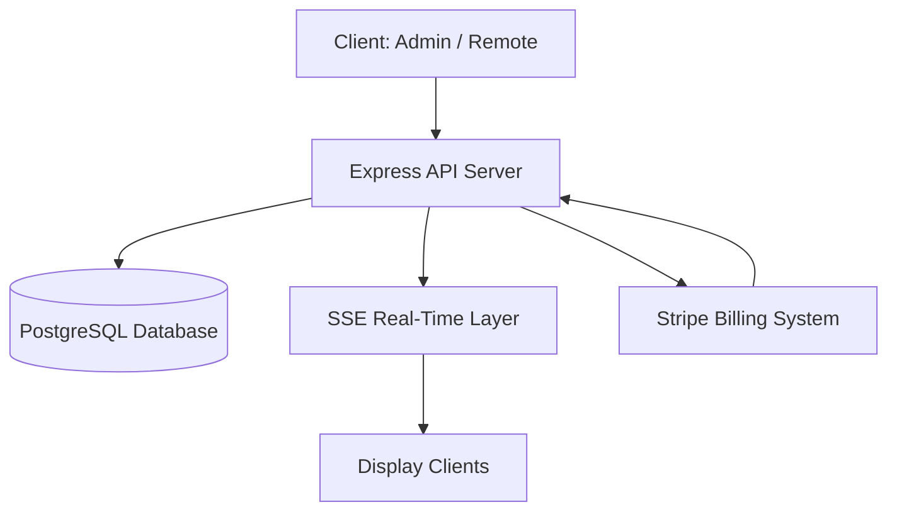

# 🧠 Kairos Live — Architecture

Real-time church service operating system for scripture display, sermon control, and multi-device synchronization.

This document describes the system architecture, data flow, and core engineering decisions behind Kairos Live.

---

## 🏗️ System Overview

Kairos Live is a **real-time, server-authoritative SaaS platform** designed for live church service operations.

The system enables:

- Sermon creation and control
- Real-time scripture and slide broadcasting
- Multi-device synchronization (display + remote + admin)
- Subscription-based access control

---

## 🧩 High-Level Architecture



---

## ⚙️ Core Components

### 🖥️ Frontend Clients
- Admin dashboard (`/dashboard`)
- Sermon controller (`/remote`)
- Display screen (`/display`)

These clients do NOT store state — they only render server data.

---

### 🚀 Backend API (Express + TypeScript)
Responsible for:
- Authentication (JWT cookies)
- Sermon CRUD operations
- State updates
- Business logic execution
- Subscription validation

---

### 🗄️ Database (PostgreSQL + Drizzle)
Stores:
- Users
- Churches (multi-tenant)
- Sermons
- Sermon items (verses, slides)
- Subscription state

All data is scoped by `church_id`.

---

### 📡 Real-Time Layer (SSE)

Kairos Live uses **Server-Sent Events (SSE)** for real-time updates.

- Display clients subscribe to event stream
- Backend pushes updates instantly
- No client polling required

---

### 💳 Billing System (Stripe)
Handles:
- Subscription creation
- Plan upgrades/downgrades
- Webhook-based state syncing
- Access control enforcement

---

## 🔄 System Data Flow

### 🎛️ Sermon Update Flow

```text
User Action (Remote)
        ↓
API Request (Express)
        ↓
Database Update (PostgreSQL)
        ↓
SSE Event Triggered
        ↓
All Display Clients Update Instantly
```

---

### 📖 Scripture Display Flow

```text
Sermon Item Selected
        ↓
Backend Resolves Content
        ↓
SSE Broadcast Event
        ↓
Display Screens Render Verse/Text
```

---

## 📡 Real-Time Design

Kairos Live uses a **server-authoritative model**:

### Rules:
- Backend is the single source of truth
- Clients cannot mutate shared state
- All updates go through API layer
- SSE broadcasts state changes

### Benefits:
- Prevents desync between screens
- Ensures consistency during live services
- Reduces client-side complexity

---

## 🏢 Multi-Tenant Architecture

Each church operates in an isolated workspace.

### Isolation model:
- `church_id` scopes all data
- Users belong to one church
- Sermons are workspace-bound
- Admins only access their organization

### Ownership hierarchy:
- 👤 Users → Church-level access
- 🧑‍💼 Admin → Manage church workspace
- 👑 Owner → Global system access

---

## 🔐 Authentication System

- JWT stored in httpOnly cookies
- Session validated on API requests
- Role-based access control (RBAC)
- Church-scoped permissions

---

## 💳 Subscription Flow

```text
User selects plan
        ↓
Stripe checkout session created
        ↓
Payment completed
        ↓
Stripe webhook sent to backend
        ↓
Subscription status updated in DB
        ↓
Access granted/updated
```

---

## 📦 State Management Philosophy

Kairos Live avoids client-side state complexity.

Instead:

- Backend = source of truth
- Clients = reactive renderers
- SSE = sync mechanism

This ensures predictable behavior during live events.

---

## ⚡ Reliability Considerations

- SSE auto-reconnect handling
- Last-known-state persistence
- Stateless client design
- Graceful failure recovery
- Webhook retry safety (Stripe)

---

## 🧠 Design Principles

- Real-time first architecture
- Server-authoritative state model
- Failure-resistant design for live environments
- Minimal client-side logic
- Multi-tenant isolation by default

---

## 🚀 Deployment Model

- Frontend: React (Vite)
- Backend: Express API server
- Database: PostgreSQL
- Hosting: Cloud deployment (SaaS model)
- Payments: Stripe
- Real-time: SSE

---

## 🧭 Summary

Kairos Live is a real-time, multi-tenant SaaS platform designed for live church service operations.

It demonstrates:

- Event-driven architecture
- Real-time synchronization systems
- SaaS multi-tenant design
- Server-authoritative state management
- Stripe-integrated subscription systems

---
