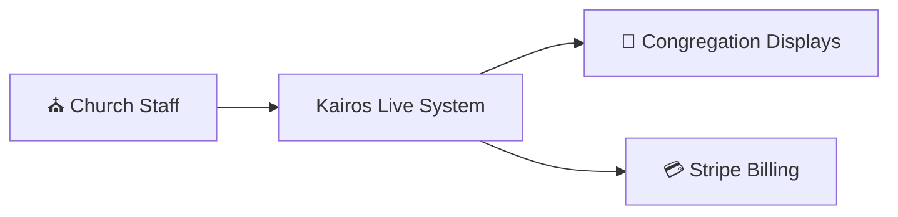
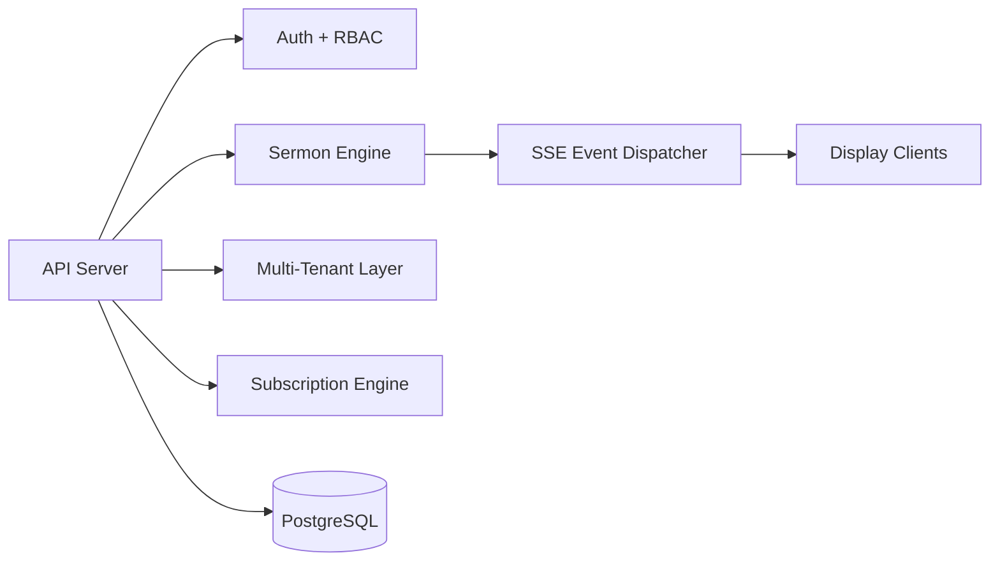
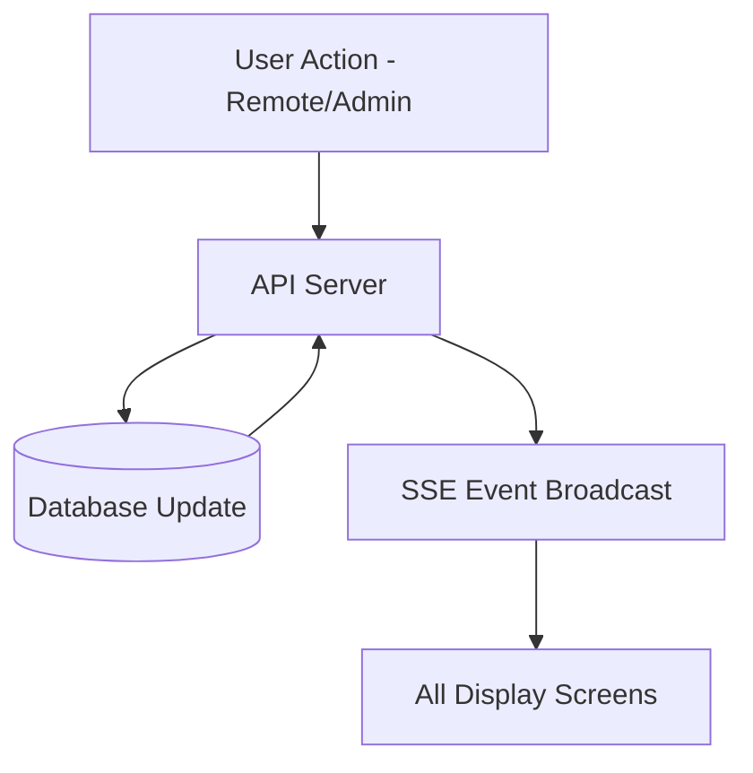
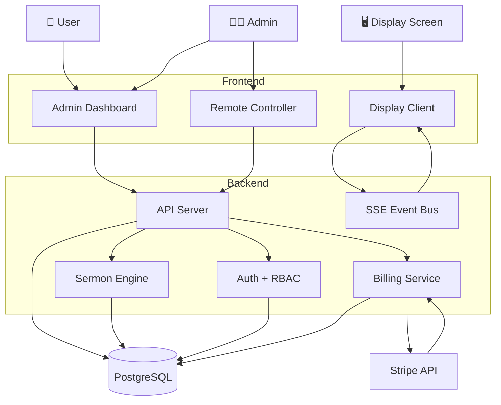
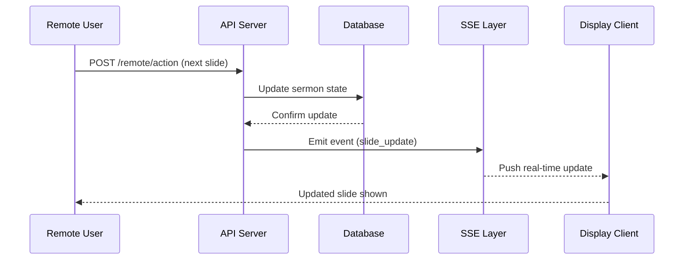
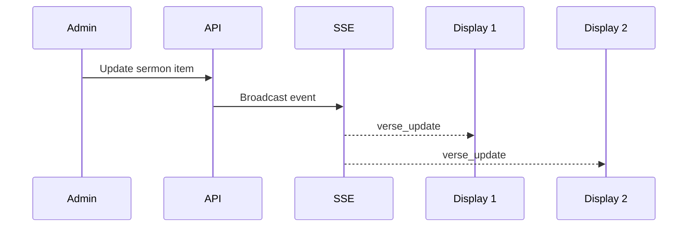
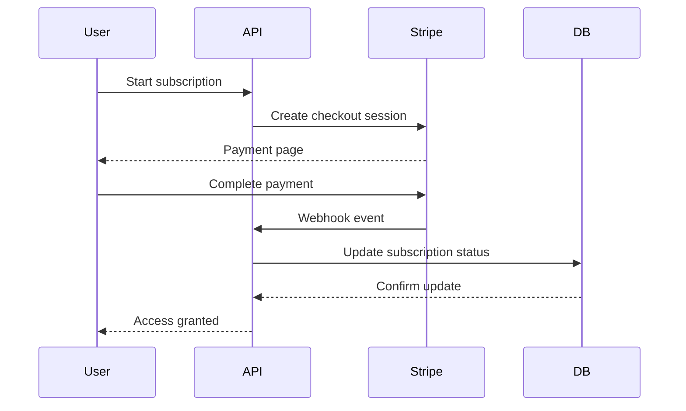
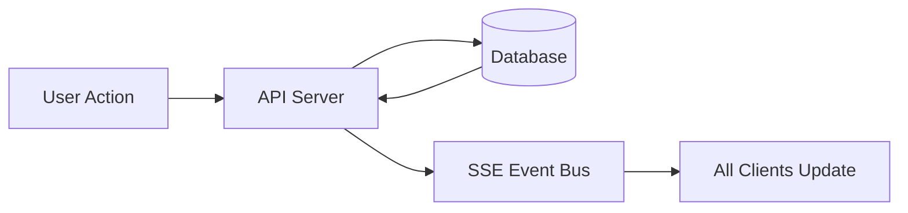

## 📊 System Architecture (C4 Model)

Kairos Live architecture is modeled using the C4 framework to represent different levels of system abstraction:

- **Level 0:** System Context
- **Level 1:** Container Architecture
- **Level 2:** Component + Runtime Behavior

---

## 🌍 Level 0 — System Context View

### Context Summary
Kairos Live operates as the central system connecting church operators, live audience displays, and external payment infrastructure.

---

## 🏗️ Level 1 — Container Architecture

### Container Summary
The system is divided into five core containers:
- Frontend clients (dashboard, remote, display)
- API server (business logic + orchestration)
- PostgreSQL database (system of record)
- SSE layer (real-time synchronization)
- Billing service (Stripe integration)

---

## ⚙️ Level 2 — Component & Runtime Behavior

---

## 🔄 Runtime Execution Model (Critical)

Kairos Live is **event-driven and server-authoritative**.

### Runtime Rules
- Backend is the **single source of truth**
- Clients do NOT maintain shared state
- All updates flow through API → DB → SSE
- Displays are passive subscribers only

---

## 📡 Real-Time System Behavior

- SSE maintains live synchronization across all devices
- No polling or client-side reconciliation required
- Every state change triggers a broadcast event
- Multiple screens stay synchronized in real time

---

## 🧠 Architecture Insight

This system demonstrates:

- Event-driven distributed architecture
- Multi-tenant SaaS design
- Server-authoritative state management
- Real-time synchronization via SSE
- Decoupled frontend clients

---

Kairos Live architecture is best understood through multiple system views:

- 🏗️ Container View (high-level system structure)
- 🔄 Runtime Flow View (how requests execute)
- 📡 Real-Time Event Flow (SSE system behavior)
- 💳 Billing Lifecycle Flow (Stripe integration)

---

## 🏗️ 1. Container Architecture (C4 Level 2)

---

## 🔄 2. Runtime Request Flow (Command Execution)

This shows how a sermon action propagates through the system.

---

## 📡 3. Real-Time SSE Event Flow

This shows the live synchronization model.

---

## 💳 4. Stripe Billing Lifecycle

---

## 🧠 5. System Behavior Model

Kairos Live operates on a **server-authoritative event-driven model**:

### Key Principles:
- Backend is single source of truth
- Clients are passive renderers
- SSE handles all synchronization
- Database validates state consistency

---
