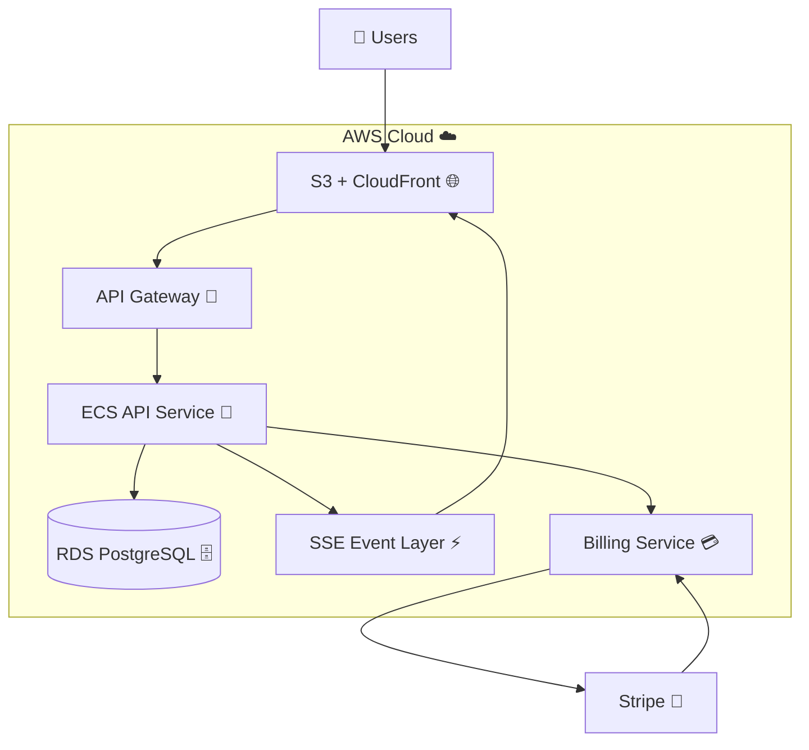
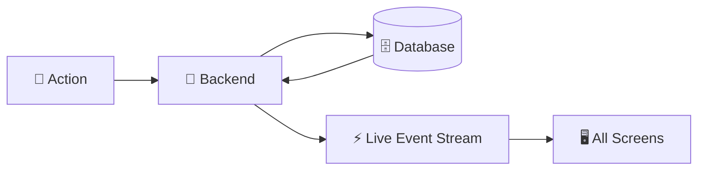
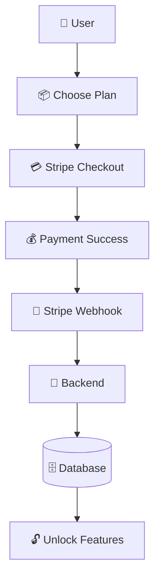

# 🧠 Kairos Live — Cloud Architecture (AWS-Style) ☁️✨

---

## 📊 System Overview 🌸

Kairos Live is a **multi-tenant, real-time SaaS platform** built for synchronized church service orchestration.

It uses a **cloud-native, event-driven architecture**, where the backend acts as the single source of truth and all updates are streamed instantly to connected devices 💫

Think:
> “One system → many screens → perfectly in sync ✨”

---

## ☁️ High-Level Cloud Architecture (AWS Mapping)

---

## 🧩 AWS Service Mapping 🪄

| ✨ Kairos Component | ☁️ AWS Equivalent |
|-------------------|-------------------|
| Frontend UI | S3 + CloudFront |
| API Routing | API Gateway |
| Backend Server | ECS / EC2 |
| Database | RDS PostgreSQL |
| Real-Time Layer | SSE / EventBridge |
| Billing | Stripe (external 💳) |

---

## ⚙️ Core Backend Services 🧠

### 🚀 API Service (ECS / EC2)
The “brain” of the system 💡

Handles:
- Sermon creation & flow control 📖  
- Authentication (JWT + RBAC) 🔐  
- Multi-tenant isolation 🏢  
- State validation & orchestration ⚙️  
- Subscription enforcement 💳  

---

### 🗄️ Database (RDS PostgreSQL)
The system’s memory 🧠

Stores:
- Users 👤  
- Churches 🏢  
- Sermons 📖  
- Slides + verses 📜  
- Subscription state 💳  

All data is safely isolated using `church_id` ✨

---

### 📡 Real-Time Event System (SSE Model)

Kairos Live uses a **push-based real-time system** ⚡

- Backend sends all updates
- Clients listen (they don’t ask, they receive 💫)
- No polling required
- Everything updates instantly across all screens

Event types:
- `verse_update` 📖  
- `slide_update` 🎞️  
- `service_state` 🎛️  
- `service_control` 🎚️  

---

### 🖥️ Frontend Layer (S3 + CloudFront)
The “display layer” 👀✨

- Admin Dashboard → controls everything 🧑‍💼  
- Remote Controller → live sermon navigation 🎮  
- Display Screen → fullscreen projection 🖥️  

Frontends are **fully stateless** — they only reflect backend truth 💫

---

## 🔄 Cloud Runtime Execution Flow ⚡

### 💡 What happens here
1. A user triggers an action 🎛️  
2. API Gateway routes the request 🚪  
3. Backend processes it 🧠  
4. Database updates safely 🗄️  
5. Event stream broadcasts instantly ⚡  
6. All screens update together ✨  

---

## 📡 Real-Time Architecture Model 💫

A simple view of the magic ✨

### 💡 The idea
- You press a button 🎛️  
- Backend updates state 🧠  
- Event is emitted ⚡  
- Every screen updates instantly ✨  

---

## 🏢 Multi-Tenant SaaS Architecture 🏠

Each church gets its own “safe space” 💖

- Isolated via `church_id`
- Fully separated data
- No cross-access between tenants
- Admins only see their workspace
- Owner has global override 👑  

---

## 💳 Billing System (Stripe Integration) 💙

Stripe handles all payments securely 💳

### Billing Flow ✨

### 💡 What happens
- User picks a plan 📦  
- Stripe processes payment 💳  
- Backend receives confirmation 🔔  
- Features unlock automatically ✨  

---

## 🧠 Cloud Architecture Characteristics ☁️

Kairos Live is built like a real production cloud system:

- Stateless backend services 🚀  
- Managed database layer 🗄️  
- Event-driven real-time updates ⚡  
- Multi-tenant SaaS isolation 🏢  
- External billing system (Stripe) 💳  
- CDN-delivered frontend 🌐  

---

## 🚀 Summary ✨

Kairos Live is a **cloud-native real-time SaaS platform** built to keep live church services perfectly synchronized across all devices 💖

It demonstrates real-world system design principles:

- Event-driven architecture ⚡  
- Multi-tenant SaaS design 🏢  
- Server-authoritative state 🧠  
- Real-time distributed sync 🖥️  
- AWS-style cloud decomposition ☁️  

---

💫 Built to make Sunday services just work — every time.
