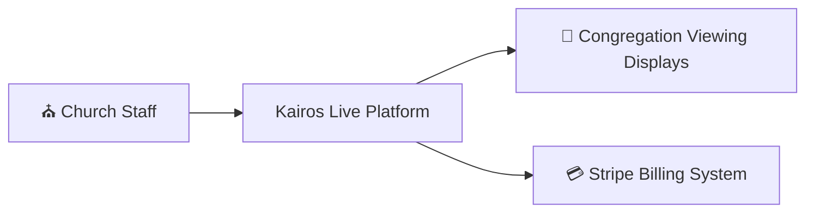
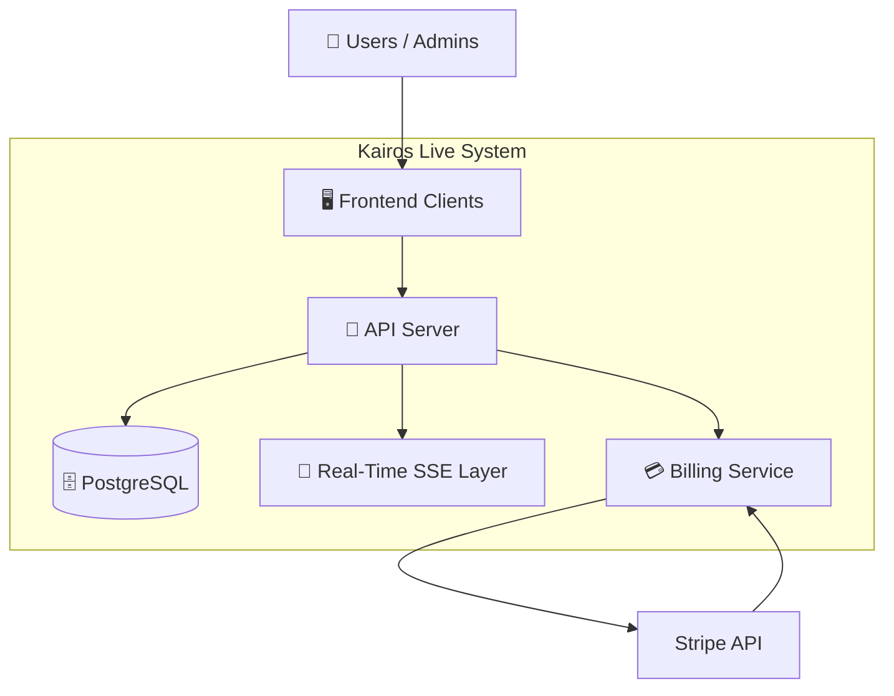
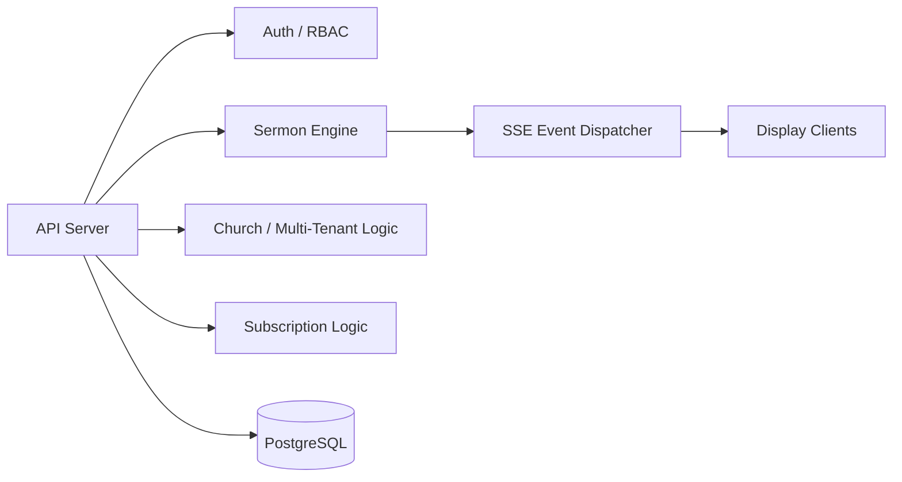
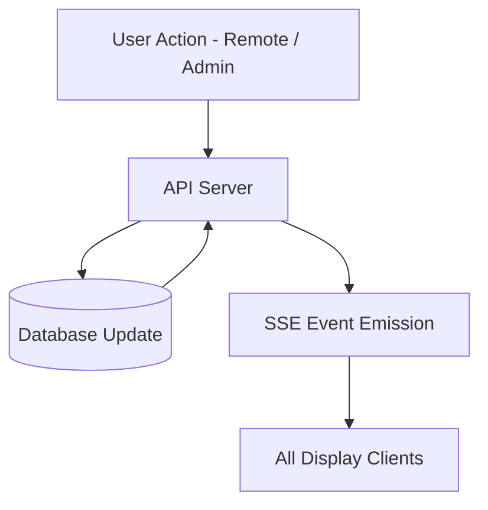
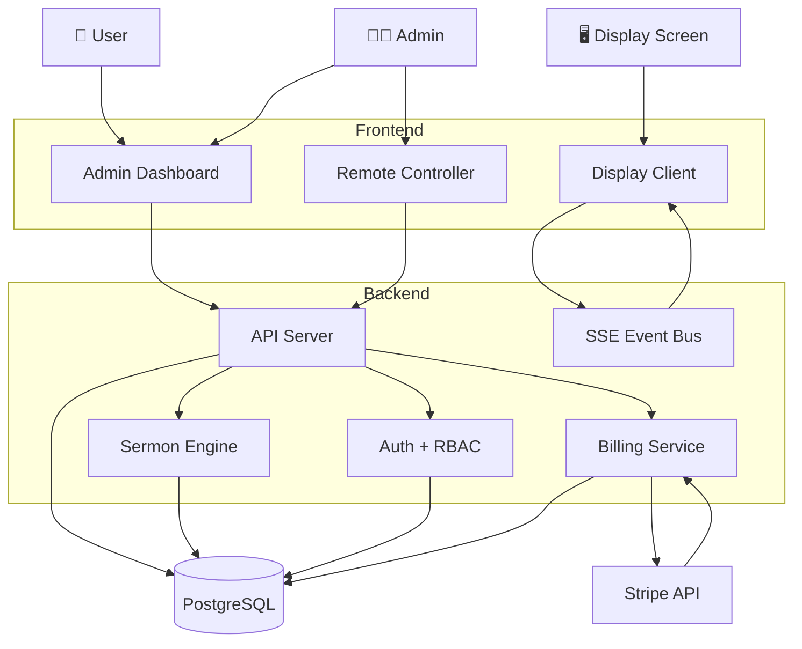
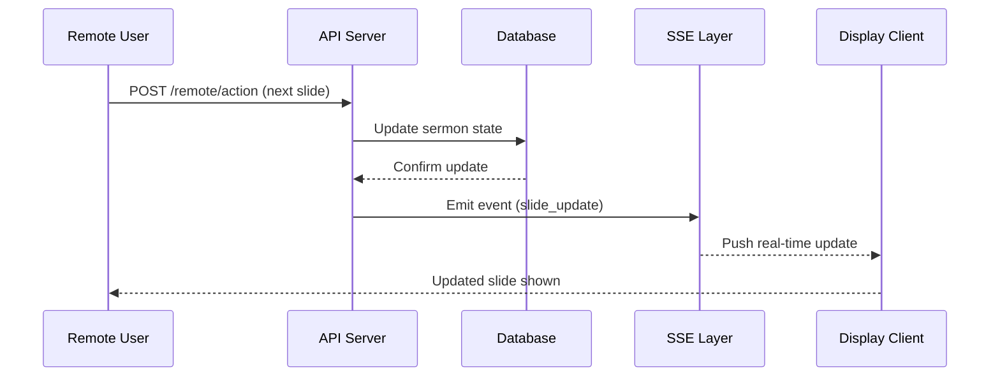
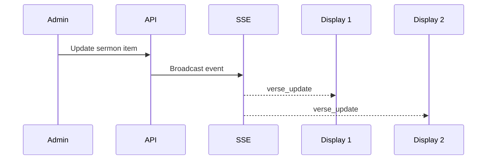
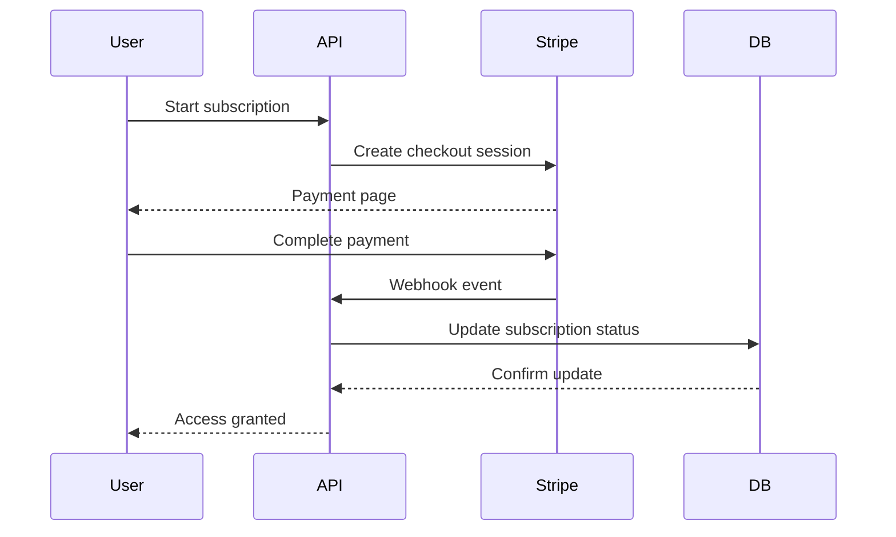
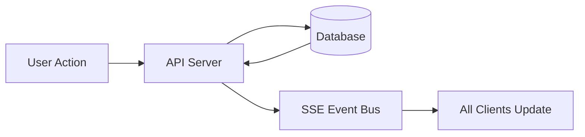

## 🧠 C4 Architecture Overview (System Levels)

Kairos Live architecture is described using a C4-style breakdown:

- **Level 0 (Context):** External users interacting with the platform  
- **Level 1 (Container):** Core services and system boundaries  
- **Level 2 (Component):** Internal service responsibilities

---

## 🌍 Level 0 — System Context

### Context Description
Kairos Live acts as the central coordination system between church operators, live audiences, and external billing infrastructure.

---

## 🏗️ Level 1 — Container Architecture

### Container Description
Kairos Live is composed of five core containers:

- Frontend clients (dashboard, remote, display)
- API server (core business logic)
- PostgreSQL database (system of record)
- SSE layer (real-time sync)
- Billing service (Stripe integration)

---

## ⚙️ Level 2 — Core Backend Components

---

## 🔄 Runtime System Behavior Model

Kairos Live operates as a **server-authoritative event-driven system**:

### Key Behavior Rules

- Backend is the **single source of truth**
- Clients never modify shared state directly
- All updates propagate through SSE events
- Database persists authoritative state
- Displays are passive renderers

---

## 📡 Real-Time Architecture Summary

- Server-Sent Events (SSE) handles live synchronization
- No polling or client-side state replication
- Event-driven propagation model ensures consistency
- Multiple displays stay synchronized in real time

---

## 🧠 Architectural Insight

This system is designed around:

- **Event-driven architecture**
- **Multi-tenant SaaS isolation**
- **Server-authoritative state management**
- **Real-time distributed synchronization**

---

Kairos Live architecture is best understood through multiple system views:

- 🏗️ Container View (high-level system structure)
- 🔄 Runtime Flow View (how requests execute)
- 📡 Real-Time Event Flow (SSE system behavior)
- 💳 Billing Lifecycle Flow (Stripe integration)

---

## 🏗️ 1. Container Architecture (C4 Level 2)

---

## 🔄 2. Runtime Request Flow (Command Execution)

This shows how a sermon action propagates through the system.

---

## 📡 3. Real-Time SSE Event Flow

This shows the live synchronization model.

---

## 💳 4. Stripe Billing Lifecycle

---

## 🧠 5. System Behavior Model

Kairos Live operates on a **server-authoritative event-driven model**:

### Key Principles:
- Backend is single source of truth
- Clients are passive renderers
- SSE handles all synchronization
- Database validates state consistency

---
