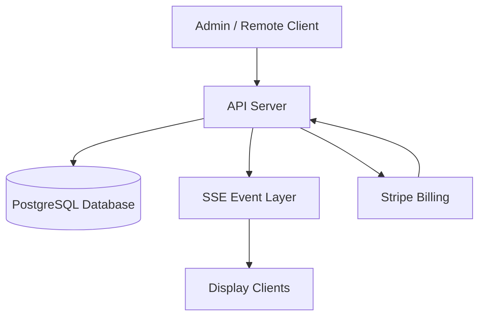

# 🧠 Kairos Live — Architecture

---

## 🏗️ System Architecture

Kairos Live is a real-time event-driven system composed of the following core components:

- 🖥️ Frontend Clients (Admin / Remote / Display)
- 🚀 API Server (Express + TypeScript)
- 🗄️ PostgreSQL Database
- 📡 SSE Real-Time Layer
- 💳 Stripe Billing System

---

## 📊 System Diagram



---

## ⚙️ Core Components

### 🚀 API Server
Handles all business logic and state mutations:
- Sermon management
- Authentication (JWT cookies)
- Role-based access control
- State updates
- Subscription validation

---

### 🗄️ Database (PostgreSQL + Drizzle)
Stores all persistent system data:

- Users
- Churches (multi-tenant scope)
- Sermons
- Sermon items (verses, slides, text)
- Subscription state

All records are scoped by `church_id`.

---

### 🖥️ Frontend Clients

- **Admin Dashboard** → system management
- **Remote Controller** → live sermon control
- **Display Screen** → fullscreen presentation view

Clients are stateless and fully server-driven.

---

### 📡 Real-Time Layer (SSE)

Kairos Live uses Server-Sent Events (SSE) for real-time synchronization.

- Backend emits events on state changes
- Display clients subscribe to event stream
- No polling required
- Updates are pushed instantly

---

## 🔄 Data Flow

### 🎛️ Sermon Update Flow

```text
Remote Action
    ↓
API Request
    ↓
Database Update
    ↓
SSE Event Trigger
    ↓
All Display Clients Update
```

---

### 📖 Display Rendering Flow

```text
Sermon State Change
    ↓
Backend Resolves Active Item
    ↓
SSE Broadcast Event
    ↓
Display Updates Instantly
```

---

## 📡 SSE Behavior Model

- Backend is the **single source of truth**
- Clients subscribe to updates only
- All mutations occur on the server
- Events are broadcast system-wide

### Event Types:
- `verse_update`
- `slide_update`
- `service_state`
- `service_control`

---

## 🏢 Multi-Tenant Model

Kairos Live is fully multi-tenant.

### Isolation Rules:
- Each church has a unique `church_id`
- All data is scoped per church
- Users cannot access other churches
- Admin access is workspace-limited

### Roles:
- 👤 User → limited access
- 🧑‍💼 Admin → church-level control
- 👑 Owner → global system access

---

## 💳 Billing System (Stripe)

### Flow:

```text
User selects plan
    ↓
Stripe Checkout Session created
    ↓
Payment processed by Stripe
    ↓
Webhook sent to backend
    ↓
Subscription status updated in DB
    ↓
Access permissions updated
```

### Responsibilities:
- Subscription creation
- Plan upgrades/downgrades
- Webhook validation
- Access enforcement

---

## 🧠 System Design Principles

- Server-authoritative state model
- Event-driven real-time architecture
- Stateless frontend clients
- Multi-tenant isolation by default
- Stripe-based access control layer
- SSE-based synchronization (no polling)

---
