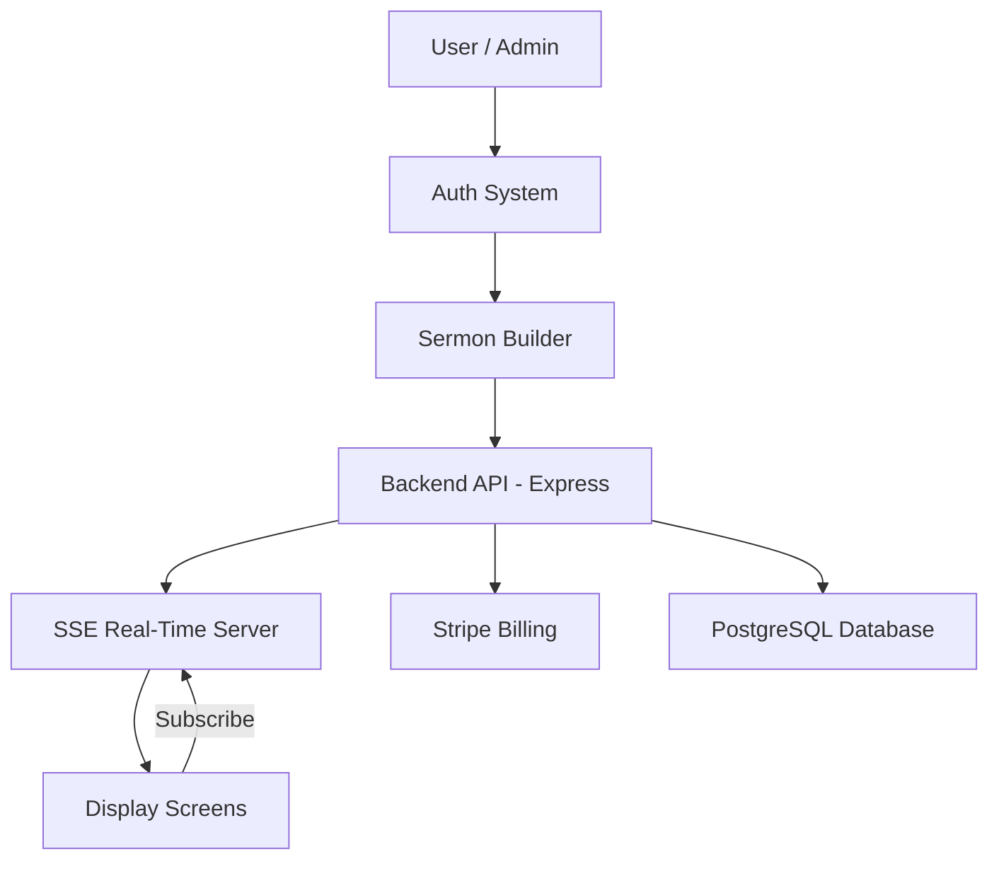

## 🧠 System Architecture



## 🔌 System API & Core Actions

Kairos Live exposes a set of internal system actions that power sermon flow, display sync, and real-time updates.

These represent how the system behaves at runtime.

---

### 🧱 Sermon Lifecycle API

```http
POST /api/sermons
```

Create a new sermon flow.

```json
{
  "title": "Sunday Service",
  "church_id": "123",
  "items": [
    { "type": "verse", "value": "John 3:16" },
    { "type": "text", "value": "Welcome to church" }
  ]
}
```

---

```http
GET /api/sermons/:id
```

Fetch sermon structure for display or editing.

---

```http
POST /api/sermons/:id/next
```

Advance to next slide in real time.

---

```http
POST /api/sermons/:id/previous
```

Go back one slide.

---

## 📡 Real-Time Display Engine (SSE)

Kairos Live uses Server-Sent Events to keep all screens in sync.

### 📲 Display Subscription

```http
GET /api/display/stream
```

Client subscribes to live sermon updates.

---

### ⚡ Event Stream Example

```json
event: verse_update
data: {
  "verse": "John 3:16",
  "translation": "KJV"
}
```

```json
event: slide_update
data: {
  "type": "text",
  "content": "Welcome to Sunday Service"
}
```

```json
event: service_state
data: {
  "status": "live",
  "active_sermon_id": "abc123"
}
```

---

## 🎛️ Remote Control API

Used by `/remote` interface (mobile/desktop controller)

```http
POST /api/remote/action
```

### Actions:

```json
{
  "action": "next"
}
```

```json
{
  "action": "previous"
}
```

```json
{
  "action": "start_service"
}
```

```json
{
  "action": "end_service"
}
```

---

## 💳 Billing System API (Stripe)

```http
POST /api/billing/subscribe
```

Creates subscription session.

```http
POST /api/billing/webhook
```

Handles Stripe updates (source of truth for access control).

---

## 🧠 System Behavior Model

Kairos Live is built on a **server-authoritative event model**:

### Rule 1 — Backend is truth
All sermon state lives in the server.

### Rule 2 — Displays are passive
Display screens only *listen*, never modify.

### Rule 3 — Remote controls are commands
All user actions are treated as events:

```
Command → Backend → SSE Broadcast → All Displays Update
```

---

## 🔄 Real-Time Flow Execution

```
User Action (Remote)
        ↓
Backend API Mutation
        ↓
State Update Stored (Postgres)
        ↓
SSE Broadcast Event Fired
        ↓
All Displays Update Instantly
```

---
