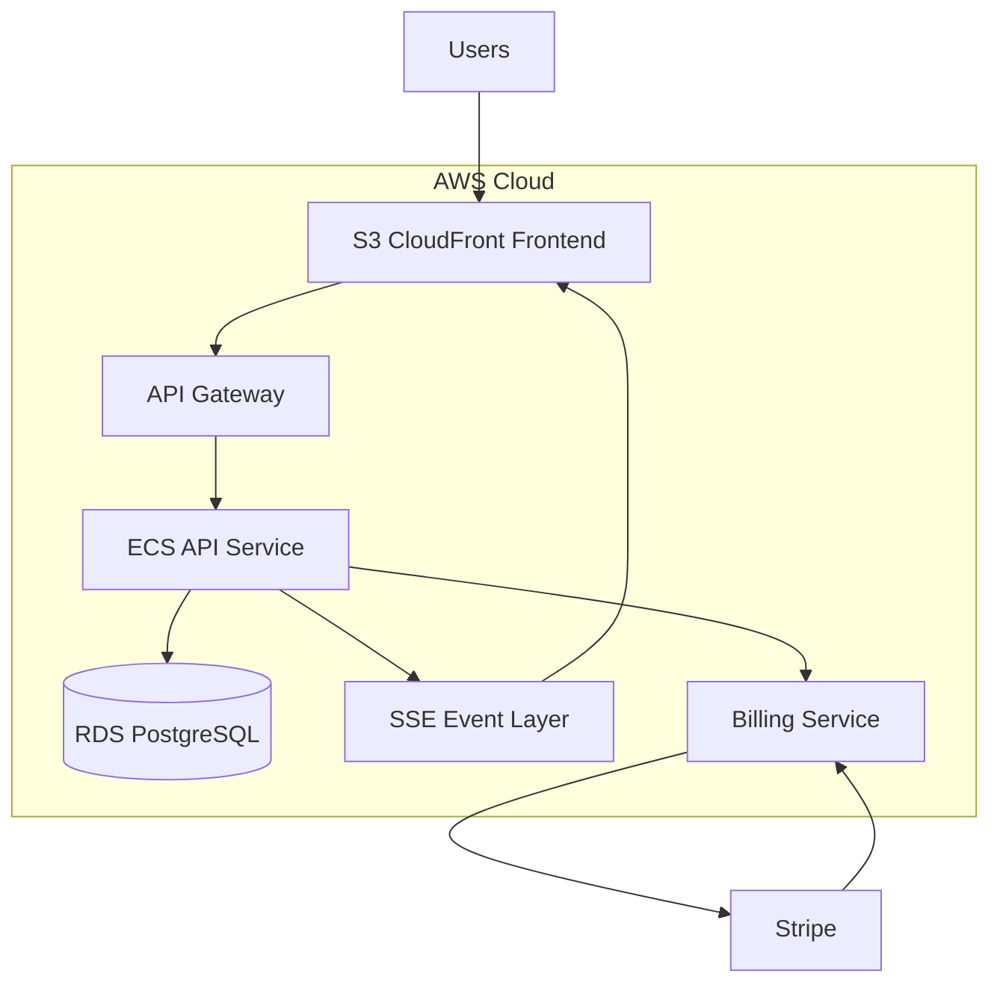
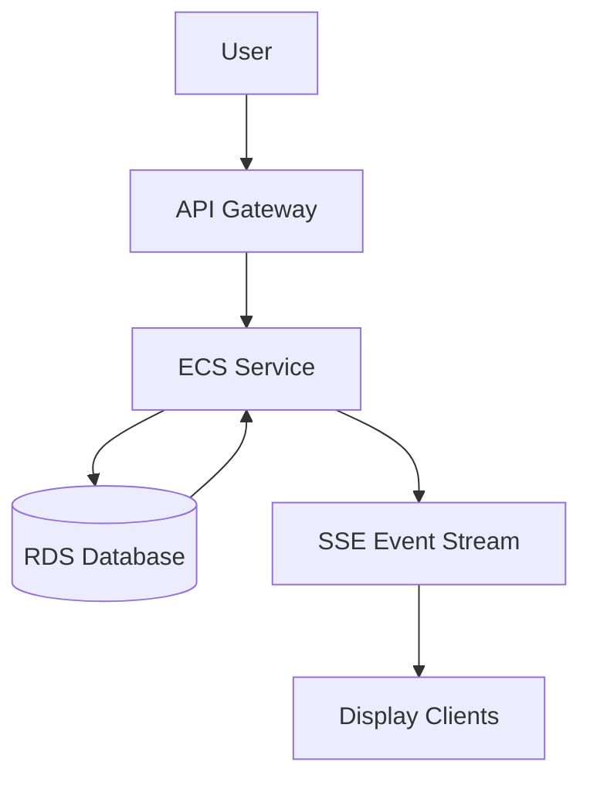

# 🧠 Kairos Live — Cloud Architecture (AWS-Style)

---

## 📊 System Overview

Kairos Live is a **multi-tenant, real-time SaaS platform** designed for synchronized church service orchestration.

It follows a **cloud-native, event-driven architecture** where all state changes are handled by backend services and propagated in real time to connected clients.

---

## ☁️ High-Level Cloud Architecture (AWS Mapping)



---

## 🧩 AWS Service Mapping

| Kairos Component | AWS Equivalent |
|-----------------|----------------|
| Frontend UI | S3 + CloudFront |
| API Routing | API Gateway |
| Backend Server | ECS / EC2 (Express + TS) |
| Database | RDS PostgreSQL |
| Real-Time Layer | SSE / WebSockets (API Gateway / EventBridge) |
| Billing | Stripe (external service) |

---

## ⚙️ Core Backend Services

### 🚀 API Service (ECS / EC2)
Handles all core business logic:
- Sermon management and execution
- Authentication (JWT + RBAC)
- Multi-tenant request isolation
- State validation and orchestration
- Subscription enforcement

---

### 🗄️ Database (RDS PostgreSQL)
System of record for all persistent data.

Core entities:
- Users
- Churches (multi-tenant isolation)
- Sermons
- Sermon items (slides, verses, text blocks)
- Subscription state

All data is scoped by `church_id` for strict isolation.

---

### 📡 Real-Time Event System (SSE / EventBridge Model)

Kairos Live uses a **push-based event system**:

- Backend is the only event producer
- State changes trigger events
- Clients subscribe to event stream
- No polling required
- Real-time synchronization across all devices

Event types:
- `verse_update`
- `slide_update`
- `service_state`
- `service_control`

---

### 🖥️ Frontend Layer (S3 + CloudFront)

Stateless frontend clients:

- Admin Dashboard → service control
- Remote Controller → live sermon navigation
- Display Screen → fullscreen projection

Clients only render server state (no local source of truth).

---

## 🔄 Cloud Runtime Execution Flow



### Execution Steps
1. User triggers action via frontend
2. API Gateway routes request to backend service
3. Backend validates and processes request
4. RDS updates system state
5. Event stream broadcasts update
6. All connected displays update instantly

---

## 📡 Real-Time Architecture Model

Kairos Live uses a **server-authoritative push model**:

```
Backend (ECS Service)
        ↓
Event Stream (SSE / WebSocket Layer)
        ↓
All Connected Frontend Clients
```

### Key Properties:
- Backend is the single source of truth
- Clients are passive subscribers
- No polling or client-side sync logic
- Strong eventual consistency across devices

---

## 🏢 Multi-Tenant SaaS Architecture

- Each church is isolated via `church_id`
- All database queries are tenant-scoped
- Authentication enforces workspace boundaries
- Users cannot access other churches
- Admin roles are scoped per organization
- Owner has global override access

---

## 💳 Billing System (Stripe Integration)

Stripe is the external billing authority.

### Billing Flow

```text
User selects subscription plan
→ Stripe Checkout Session created
→ Payment processed by Stripe
→ Stripe webhook sent to backend API
→ Subscription updated in RDS
→ Feature access enforced in backend
```

### Responsibilities:
- Subscription lifecycle management
- Plan upgrades and downgrades
- Webhook verification
- Access control enforcement

---

## 🧠 Cloud Architecture Characteristics

Kairos Live demonstrates production-grade cloud engineering patterns:

- Stateless backend services (ECS / EC2)
- Managed database layer (RDS)
- Event-driven real-time system design
- Multi-tenant SaaS isolation model
- Externalized billing system (Stripe)
- Decoupled frontend via CDN delivery

---

## 🚀 Summary

Kairos Live is a cloud-native, real-time SaaS platform built for synchronized live service management.

It demonstrates production-level system design principles including:
- Event-driven architecture
- Multi-tenant SaaS design
- Server-authoritative state management
- Real-time distributed synchronization
- Cloud service decomposition (AWS-style)

---
