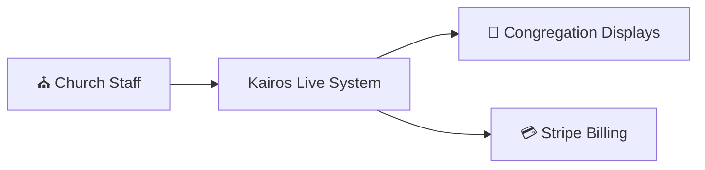
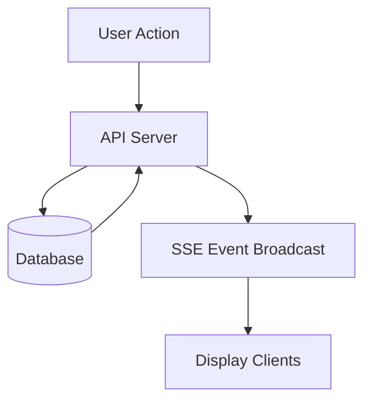

# 🧠 Kairos Live — Architecture

---

## 📊 System Overview (C4 Model)

Kairos Live is a **multi-tenant, real-time SaaS system** designed for synchronized church service orchestration.

It follows an **event-driven, server-authoritative architecture**, where all state changes originate from the backend and propagate in real time via SSE.

---

## 🌍 Level 0 — System Context



---

## 🏗️ Level 1 — Container Architecture


---

## ⚙️ Core System Components

### 🚀 API Server
- Sermon management
- Authentication (JWT + RBAC)
- State validation
- Business logic execution
- Subscription enforcement

---

### 🗄️ Database (PostgreSQL)
System of record for all data:
- Users
- Churches (multi-tenant scoped)
- Sermons
- Sermon items (slides, verses, text)
- Subscription state

All data is scoped by `church_id`.

---

### 🖥️ Frontend Clients
Stateless UI layers:
- Admin Dashboard
- Remote Controller
- Display Screen

Clients only render backend state.

---

### 📡 SSE Real-Time Layer
- Server emits events on state changes
- Clients subscribe to event stream
- No polling
- Instant sync across all displays

Event types:
- `verse_update`
- `slide_update`
- `service_state`
- `service_control`

---

## 🔄 Runtime Execution Model



### Execution Flow
1. User triggers action (admin/remote)
2. API validates request
3. Database updates system state
4. SSE emits event
5. All clients update instantly

---

## 📡 Real-Time System Behavior

- Backend is the single source of truth
- Clients are passive subscribers
- SSE handles all synchronization
- No polling or local state replication
- Ensures eventual consistency across devices

---

## 🏢 Multi-Tenant Architecture

- Each church is isolated via `church_id`
- All data is tenant-scoped
- Authentication enforces workspace boundaries
- Users cannot access other tenants
- Admin access is scoped per church
- Owner has global override access

---

## 💳 Billing System (Stripe)

### Flow

```text
User selects plan
→ Stripe Checkout Session
→ Payment completed
→ Stripe webhook sent to backend
→ Subscription updated in database
→ Access permissions enforced
```

### Responsibilities
- Subscription lifecycle management
- Plan upgrades/downgrades
- Webhook validation
- Access control enforcement

---

## 🧠 System Design Characteristics

Kairos Live demonstrates production SaaS architecture patterns:

- Event-driven distributed system
- Server-authoritative state management
- Multi-tenant SaaS isolation
- Stateless frontend architecture
- Real-time synchronization via SSE
- External billing integration (Stripe)

---

## 🚀 Summary

Kairos Live is a production-grade real-time SaaS system for synchronized live service management.

It demonstrates real-world system design principles including event-driven architecture, multi-tenancy, and server-authoritative state propagation.

---
