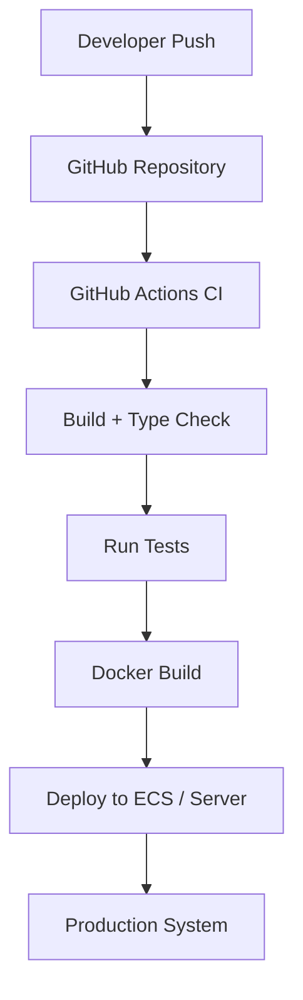
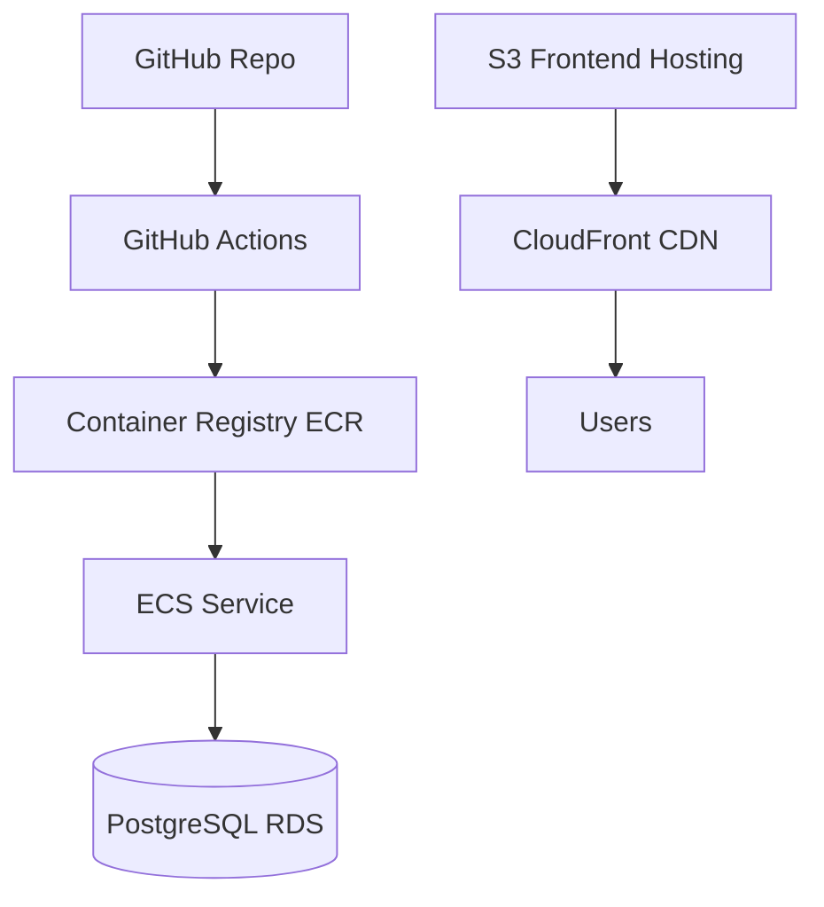

# ⚙️ Kairos Live — CI/CD Pipeline & Deployment 🚀

---

## 🌸 Overview

Kairos Live uses a **modern CI/CD workflow** designed to ensure safe, repeatable, and automated deployments.

The goal is simple:

> Every change should be testable, buildable, and deployable without manual intervention.

---

## 🧠 CI/CD Philosophy

Kairos Live follows these principles:

- Every commit is validated automatically ✅  
- Builds are reproducible across environments 🔁  
- Deployments are automated and traceable 🚀  
- Production stability is prioritized over speed 🛡️  

---

## 🔄 High-Level CI/CD Flow



---

## 🏗️ Deployment Architecture (AWS-Style)



---

## ⚙️ CI Pipeline Stages

### 1. 🔍 Code Validation
- TypeScript compilation check
- Linting (code quality enforcement)
- Basic build validation

---

### 2. 🧪 Testing Stage
- Unit tests (if present)
- API route validation
- Schema validation (Drizzle models)

---

### 3. 🏗️ Build Stage
- Frontend build (Vite)
- Backend build (TypeScript → JS)
- Asset optimization

---

### 4. 🐳 Containerization
- Docker image build
- Environment variable injection
- Version tagging

---

### 5. 🚀 Deployment Stage
- Push image to ECR (or equivalent registry)
- Deploy to ECS service
- Rolling updates to avoid downtime

---

## 🌍 Environment Strategy

Kairos Live uses separated environments:

### 🧪 Development
- Local machine or dev branch
- Fast iteration
- Debug logging enabled

### 🧱 Staging (optional)
- Production-like environment
- Used for final testing before deploy

### 🚀 Production
- Live SaaS system
- Strict validation
- Auto-scaling enabled

---

## 🔁 Deployment Strategy

Kairos uses a **rolling deployment model**:

```text
Old Version → Gradual Replacement → New Version
```

### Benefits:
- No downtime during updates
- Safe rollback if failures occur
- Continuous availability for live services (Sunday-safe)

---

## 🛡️ Rollback Strategy

If a deployment fails:

- ECS automatically rolls back to last stable version
- Previous Docker image is retained
- No data loss (DB is independent)

---

## 📡 Infrastructure Components

### 🚀 Backend (ECS / EC2)
- Runs API server (Express + TypeScript)
- Handles all business logic
- Stateless design

---

### 🗄️ Database (RDS PostgreSQL)
- Persistent system of record
- Multi-tenant (`church_id` isolation)
- Backed up automatically

---

### 🌐 Frontend (S3 + CloudFront)
- Static React/Vite build
- Globally distributed CDN
- No server dependency

---

## ⚡ CI/CD Design Principles

Kairos Live CI/CD is built around:

- Automated validation before deploy 🔍  
- Immutable build artifacts 🧱  
- Zero-downtime deployment strategy 🚀  
- Environment separation (dev/staging/prod) 🌍  
- Infrastructure as a repeatable pipeline ⚙️  

---

## 🧠 What This Enables

This pipeline ensures:

- Every push is safely testable
- Production updates are predictable
- No manual deployment risk
- Live Sunday services are never interrupted
- System evolves continuously without downtime

---

## 🚀 Summary

Kairos Live CI/CD pipeline demonstrates:

- Modern DevOps workflow design
- AWS-style deployment architecture
- Containerized backend delivery
- Automated build/test/deploy pipeline
- Production-safe release strategy

---

💡 End goal:

> “Push code → system safely updates → churches never experience downtime”
