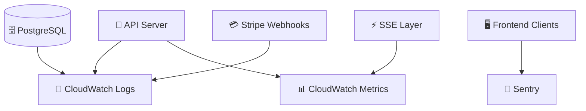
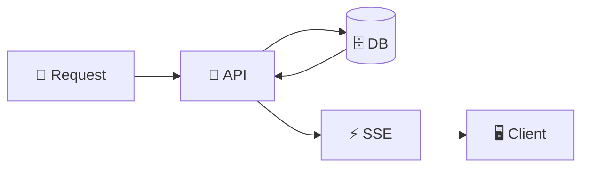

# 📊 Kairos Live — Observability & Monitoring ☁️✨

---

## 🌸 Overview

Kairos Live is designed with a **production-aware observability model**, ensuring system health, performance, and reliability can be tracked across all layers.

The system follows a simple principle:

> “If it can fail, it should be visible 💡”

---

## 🧠 Observability Stack (Conceptual AWS Mapping)



---

## 📡 What We Monitor

### 🚀 Backend (API Server)

We track:
- request latency ⏱️
- endpoint usage patterns 📊
- error rates 🚨
- authentication failures 🔐
- subscription validation issues 💳

---

### ⚡ Real-Time Layer (SSE)

Critical real-time metrics:
- active connections 👥
- connection drops 📉
- event delivery delay ⏱️
- event failure rate 🚨
- reconnect frequency 🔁

---

### 🗄️ Database (PostgreSQL)

We monitor:
- slow queries 🐢
- connection pool saturation 🔌
- read/write latency 📊
- tenant query distribution 🏢

---

### 🖥️ Frontend Clients

Tracked via:
- Sentry error reporting 🐞
- UI crashes or rendering failures
- failed SSE reconnects
- display desync events

---

### 💳 Billing System (Stripe)

Monitored events:
- failed payments ❌
- webhook failures ⚠️
- subscription sync mismatches
- checkout completion rate

---

## 📊 Key Metrics (System Health Signals)

Kairos Live defines core “health indicators”:

### System-Level Metrics
- API response time (p95 latency)
- SSE event delivery time
- DB query latency
- error rate per endpoint

### Business-Level Metrics
- active churches 🏢
- active services 🎛️
- sermon session duration 📖
- subscription conversion rate 💳

---

## 🚨 Alerting Strategy

Alerts are triggered when:

- API error rate spikes 🚨
- SSE connection drops increase 📉
- DB latency exceeds threshold 🐢
- Stripe webhook failures occur 💳
- frontend crash rate increases 🖥️

Alerts would route to:
- email notifications 📧
- Slack (optional integration 💬)
- admin dashboard warnings 🧑‍💼

---

## 📡 Logging Strategy

Kairos uses layered logging:

### 1. Application Logs
- API request logs
- authentication logs
- sermon state changes

### 2. System Logs
- DB query logs
- SSE connection lifecycle logs
- webhook processing logs

### 3. Event Logs (Important)
Every critical action produces an event trace:

```text
User Action → API → DB → SSE → Clients
```

This allows full replay/debugging of system behavior.

---

## 🧠 Distributed Tracing Model (Conceptual)

Even without full tracing tools like Jaeger, Kairos is structured for traceability:



Each step can be logged with:
- request_id
- church_id (tenant)
- timestamp
- event type

---

## 🔁 Real-Time Debugging Flow

If something goes wrong in a live service:

1. Check API logs 📄  
2. Check DB state 🗄️  
3. Verify SSE event emission ⚡  
4. Confirm client reception 🖥️  
5. Validate Stripe sync (if billing-related) 💳  

---

## 🧱 Observability Design Principles

Kairos Live follows these principles:

- Everything is traceable 🔍  
- Backend is the single source of truth 🧠  
- Events are loggable and replayable 🔁  
- Failures must be visible, not silent 🚨  
- Real-time systems require connection awareness ⚡  

---

## 🚀 Summary

Kairos Live is designed with **production-grade observability awareness**, including:

- backend monitoring 📊  
- real-time event tracking ⚡  
- database performance visibility 🗄️  
- frontend error reporting 🖥️  
- billing reliability tracking 💳  

---

💡 Goal: If something breaks on Sunday, you know immediately — and exactly where.
