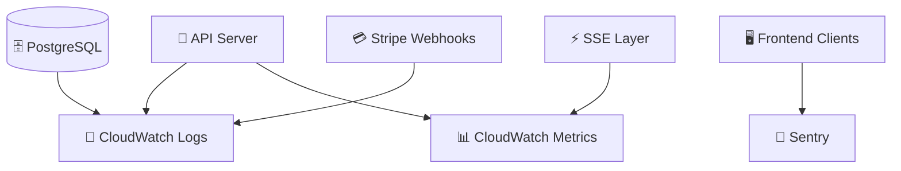

# 📊 Kairos Live — Observability & Monitoring ☁️✨

---

## 🌸 Overview

Kairos Live is designed with a **pre-deployment observability model** to ensure system health, performance, and reliability can be tracked across all major components.

The system follows a core principle:

> “If it can fail, it should be visible 💡”

---

## 🧠 Observability Stack (Conceptual AWS Mapping)


---
## 📡 What We Monitor

---

### 🚀 Backend (API Server)

Tracked signals:

- request latency ⏱️  
- endpoint usage patterns 📊  
- error rates 🚨  
- authentication failures 🔐  
- subscription validation issues 💳  

---

### ⚡ Real-Time Layer (SSE)

Key real-time metrics:

- active connections 👥  
- connection drops 📉  
- event delivery delay ⏱️  
- event failure rate 🚨  
- reconnect frequency 🔁  

---

### 🗄️ Database (PostgreSQL)

Monitored areas:

- slow queries 🐢  
- connection pool usage 🔌  
- read/write latency 📊  
- tenant query distribution 🏢  

---

### 🖥️ Frontend Clients

Frontend reliability signals:

- UI runtime errors 🐞  
- SSE reconnect failures 🔁  
- display rendering issues 🖥️  
- client desync events ⚠️  

*(typically surfaced via tools like Sentry)*

---

### 💳 Billing System (Stripe)

Tracked billing events:

- failed payments ❌  
- webhook failures ⚠️  
- subscription sync issues  
- checkout completion rate  

---

## 📊 Key System Metrics

---

### System Health Metrics

- API response time (p95 latency)  
- SSE event delivery time  
- database query latency  
- error rate per endpoint  

---

### Product Metrics (future-facing)

- active churches 🏢  
- active sermon sessions 🎛️  
- average service duration 📖  
- subscription conversion rate 💳  

---

## 🚨 Alerting Strategy

Alerts are triggered when thresholds are exceeded:

- API error rate spikes 🚨  
- SSE connection drops increase 📉  
- database latency rises 🐢  
- Stripe webhook failures occur 💳  
- frontend error rate increases 🖥️  

### Alert destinations (conceptual):

- email notifications 📧  
- Slack integration 💬  
- admin dashboard warnings 🧑‍💼  

---

## 📡 Logging Strategy

Kairos uses layered logging:

### 1. Application Logs

- API request logs  
- authentication events  
- sermon state changes  

---

### 2. System Logs

- database queries  
- SSE connection lifecycle events  
- webhook processing logs  

---

### 3. Event Logs

Every critical action follows a traceable flow:

```text
User Action → API → DB → SSE → Clients
