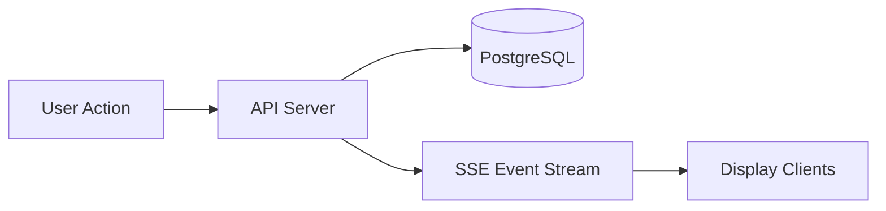
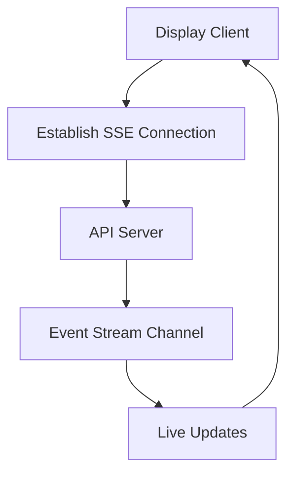

# ⚡ Kairos Live — Real-Time System (SSE Architecture)

---

## 🌸 Overview

Kairos Live is a **real-time, event-driven SaaS system** that synchronizes sermon content across multiple devices instantly.

It uses **Server-Sent Events (SSE)** to push updates from the backend to all connected clients.

The design principle is:

> “One change → instantly reflected everywhere ✨”

---

## 🧠 Real-Time Architecture Model



### 💡 What this means
- User triggers an action (next slide, verse change, etc.)
- Backend processes and stores the state
- SSE broadcasts the update
- All connected displays update instantly

---

## 📡 SSE System Design

### 🚀 Server-Sent Events Flow



---

## ⚙️ Core Real-Time Principles

### 🧠 1. Server-Authoritative State
- Backend is the ONLY source of truth
- Clients never mutate shared state directly

---

### ⚡ 2. Push-Based Updates
- No polling
- No client-side syncing loops
- Updates are pushed instantly via SSE

---

### 🖥️ 3. Stateless Clients
- Display screens are fully stateless
- They only render received events
- Reconnect = full state rehydrate

---

### 🔁 4. Reconnection Safety
- Clients automatically reconnect on disconnect
- On reconnect, latest state is re-fetched from DB
- No manual refresh required

---

## 🔄 Event Types

Kairos Live uses structured event broadcasting:

- `verse_update` → scripture changes 📖  
- `slide_update` → sermon flow changes 🎤  
- `service_state` → service status changes 🎛️  
- `service_control` → remote commands 🎮  

---

## 🧩 Runtime Behavior

### 📖 Example Flow (Live Sermon)

```text
Pastor clicks "Next Slide"
        ↓
Remote Client sends request
        ↓
API updates database
        ↓
SSE emits slide_update event
        ↓
All display screens update instantly
```

---

## ⚡ Why SSE (Not WebSockets)

Kairos uses SSE because:

- simpler connection model 🔌  
- auto-reconnect built-in 🔁  
- perfect for one-way updates 📡  
- lower operational complexity than WebSockets  

Ideal for:
> broadcast-style real-time systems like live displays

---

## 🧠 Failure Handling

If connection drops:

1. Client automatically reconnects 🔁  
2. Server sends latest state 📦  
3. Display re-renders instantly 🖥️  
4. No user intervention required  

---

## 🏢 Multi-Client Synchronization

Kairos supports multiple simultaneous screens:

- main projector display 🖥️  
- backup display screen 🖥️  
- mobile remote controller 📱  

All stay perfectly synchronized via SSE stream.

---

## 🧱 Design Principles

Kairos real-time system follows:

- Single source of truth (backend) 🧠  
- Stateless clients 🖥️  
- Event-driven updates ⚡  
- Automatic recovery on reconnect 🔁  
- No polling or client sync logic 🚫  

---

## 🚀 Summary

Kairos Live real-time system ensures:

- instant updates across all devices ⚡  
- zero manual refresh required 🔁  
- consistent sermon state everywhere 🧠  
- lightweight, scalable event streaming 📡  

---

💡 End goal:

> “When one person changes the service, everyone sees it instantly — without thinking about it.”
