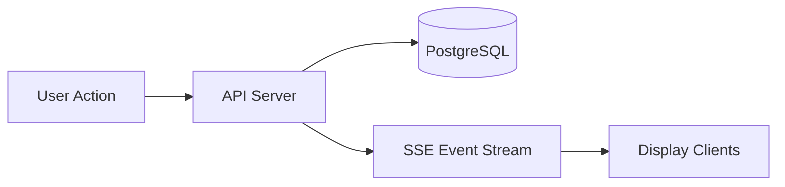

# ⚡ Kairos Live — Real-Time System (SSE Architecture)

---

## 🌸 Overview

Kairos Live is a **pre-deployment, real-time SaaS system design** built around Server-Sent Events (SSE) for instant, server-driven updates across connected clients.

It uses **Server-Sent Events (SSE)** to stream updates from the backend to all connected clients in real time.

The core design principle is:

> “One change → instantly reflected everywhere ✨”

---

## 🧠 Real-Time Architecture Model


---

## 💡 Flow Explanation

- A user triggers an action (e.g., next slide, verse change)
- The backend processes and persists the new state
- An SSE event is emitted from the server
- All connected clients receive the update instantly

---

## 📡 SSE System Design

### 🚀 Event Streaming Flow

---

## ⚙️ Core Real-Time Principles

### 🧠 1. Server-Authoritative State
- The backend is the single source of truth
- Clients never directly modify shared state

---

### ⚡ 2. Push-Based Updates
- No polling mechanisms
- No client-side synchronization loops
- Updates are pushed instantly via SSE

---

### 🖥️ 3. Stateless Clients
- Display clients hold no persistent state
- They render only what the server sends
- Reconnect triggers a full state refresh

---

### 🔁 4. Reconnection Safety
- Clients automatically reconnect on disconnect
- Latest state is re-fetched from the server
- No manual refresh is required

---

## 🔄 Event Types

Kairos Live uses structured event broadcasting:

- `verse_update` → scripture changes 📖  
- `slide_update` → sermon flow updates 🎤  
- `service_state` → service status changes 🎛️  
- `service_control` → remote control actions 🎮  

---

## 🧩 Runtime Behavior Example

### 📖 Live Sermon Flow

```text
User clicks "Next Slide"
        ↓
Remote client sends request
        ↓
API updates database state
        ↓
SSE emits `slide_update` event
        ↓
All display screens update instantly
