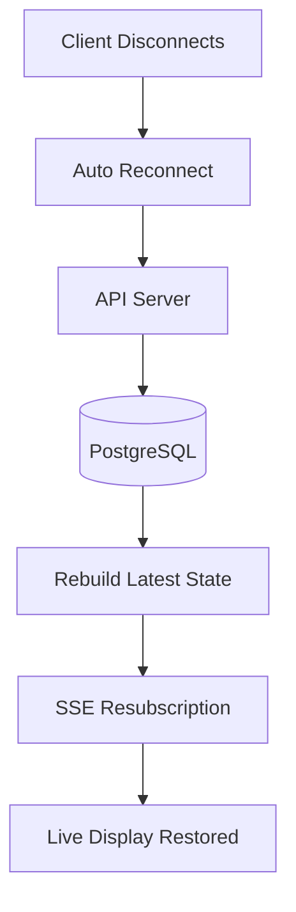

# 🛡️ Kairos Live — Reliability & Fault Tolerance

---

## 🌸 Overview

Kairos Live is designed as a **Sunday-critical real-time system**, meaning reliability is treated as a core architectural requirement.

The system assumes:

> Failures WILL happen — the system must recover automatically without disrupting live services.

---

## 🧠 Reliability Model

Kairos Live follows a **server-authoritative + recovery-first design model**:

- Backend is the single source of truth 🧠  
- Clients are disposable and recoverable 🖥️  
- State is stored in the database 🗄️  
- Real-time events are ephemeral ⚡  
- Systems must self-heal on reconnect 🔁  

---

## 🔄 Failure Recovery Flow



### 💡 What this ensures
- No permanent session loss
- Displays recover automatically
- System state is always rebuildable
- Users do not manually refresh anything

---

## ⚡ SSE Reliability Strategy

Since Kairos uses SSE for real-time updates, reliability focuses on connection stability:

### 🔁 Auto-Reconnect Strategy
- Client automatically reconnects on disconnect
- Exponential backoff retry logic
- Immediate resubscription to event stream

### 🧾 Event Recovery Strategy
- Each client tracks last received event
- On reconnect → server can replay latest state
- Database always contains final truth

---

## 🧠 State Recovery Model

Kairos does NOT rely on in-memory state.

Instead:

```text
DB = Source of Truth
SSE = Delivery Layer
Client = Render Layer
```

### Recovery Flow:
1. Client reconnects
2. API fetches current sermon state from DB
3. SSE resumes streaming updates
4. Display re-renders instantly

---

## 🗄️ Database Reliability

PostgreSQL is treated as the **system of record**.

### Reliability mechanisms:
- ACID transactions ensure consistency
- Multi-tenant isolation via `church_id`
- No reliance on in-memory critical state
- Safe rollback on failed operations

---

## ⚠️ Failure Scenarios & Handling

### 🚨 API Failure
- ECS restarts service
- Load balancer reroutes traffic
- Clients reconnect automatically

---

### 🚨 SSE Disconnect
- Client reconnects automatically
- State is rehydrated from database
- No manual refresh required

---

### 🚨 Database Latency
- Requests may retry at API layer
- Connection pooling reduces overload
- Future: read replicas for scaling stability

---

### 🚨 Stripe Webhook Failure
- Webhooks retried by Stripe automatically
- API validates event idempotency
- Subscription state reconciled from Stripe source

---

## 🔁 Idempotency Strategy

Critical operations are designed to be safe on retry:

- Subscription updates
- Sermon state changes
- Event emissions

If the same request is received twice:
→ system state remains unchanged

---

## 🧩 Service Isolation Principles

Each system layer is isolated:

- Frontend cannot mutate state directly
- SSE cannot modify database
- Database does not depend on client state
- API is the only mutation layer

---

## 🛡️ Reliability Design Principles

Kairos Live is built around:

- No single point of failure (logical separation) ⚡  
- Stateless frontend clients 🖥️  
- Recoverable real-time streams 🔁  
- Database-backed truth 🗄️  
- Automatic reconnection everywhere 🔌  
- Safe retry behavior (idempotency) 🧠  

---

## 🚀 Summary

Kairos Live is designed to remain stable even under:

- network drops 📶  
- server restarts 🔄  
- client disconnects 🖥️  
- high traffic spikes 📈  

The system prioritizes:

> “Recovery is more important than perfection in real-time systems.”

---

💡 End goal: No matter what breaks, Sunday service keeps running.
