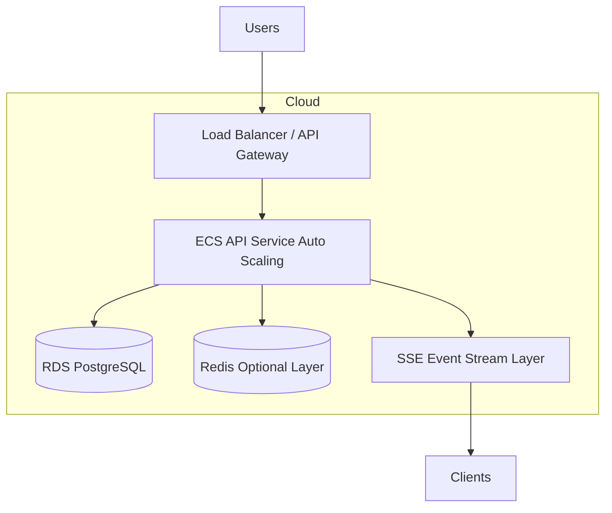
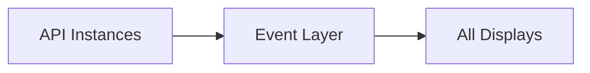
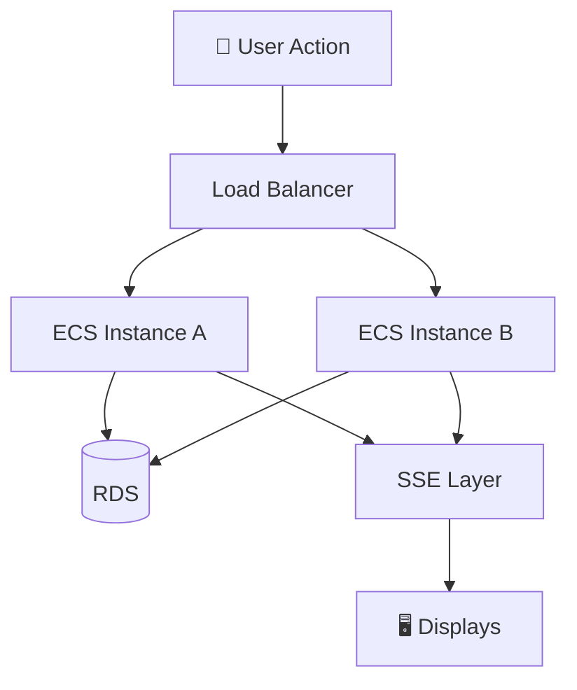

# ⚡ Kairos Live — Scaling Architecture ☁️✨

---

## 🌸 Overview

Kairos Live is designed as a **horizontally scalable, event-driven SaaS system** that supports multiple churches, simultaneous live services, and real-time display synchronization.

The scaling model is based on a simple principle:

> “Scale the backend, keep clients lightweight, and push work outward 💫”

---

## ⚡ High-Level Scaling Model



### 💡 What this shows
- Users enter through a load balancer
- Requests are distributed across ECS API instances
- PostgreSQL remains the single source of truth
- Redis is optional for caching/scaling improvements
- SSE pushes real-time updates to all connected clients
- Frontend stays stateless and horizontally scalable
---

## 📈 What Scales in Kairos Live

### 🚀 1. API Layer (Horizontal Scaling)

The API layer scales horizontally using ECS / container replicas.

It scales based on:
- request volume 📊
- CPU usage 🧠
- concurrent active services 🎛️

💡 Multiple API instances can run at once safely because:
- state lives in PostgreSQL
- services are stateless

---

### 🗄️ 2. Database Scaling (RDS)

PostgreSQL scaling strategies:

- vertical scaling (initial stage)
- read replicas for heavy read workloads 📖
- connection pooling (critical for SSE traffic)

💡 Multi-tenant structure (`church_id`) helps partition load logically.

---

### ⚡ 3. Real-Time Layer Scaling (SSE)

This is the most sensitive part of the system.

Scaling strategy:
- each API instance manages SSE connections
- clients reconnect automatically if instance changes
- optional shared event layer (Redis Pub/Sub concept)

```text
API Instance A → Clients A
API Instance B → Clients B
```

---

### 🧠 4. Event Propagation Scaling Model

To avoid bottlenecks:



Future upgrade path:
- Redis Pub/Sub
- EventBridge
- Kafka (large-scale version)

---

### 🖥️ 5. Frontend Scaling

Frontend is fully static:

- hosted on S3 + CloudFront 🌐
- infinitely scalable
- no server load impact

Clients:
- Admin Dashboard 🧑‍💼
- Remote Controller 🎮
- Display Screens 🖥️

---

## 🔁 Scaling Runtime Behavior



### 💡 What this means
- requests are distributed across API instances
- database remains single source of truth
- events are broadcast to all clients
- system grows horizontally without redesign

---

## 🧱 Scaling Bottlenecks (Important Reality)

### ⚠️ 1. SSE Connection Limits
- browsers limit concurrent connections
- each API instance holds many open sockets

👉 Mitigation:
- sticky sessions OR
- Redis event fanout layer

---

### ⚠️ 2. Database Saturation
- heavy read/write during live services

👉 Mitigation:
- connection pooling
- read replicas
- caching layer (Redis)

---

### ⚠️ 3. Event Fanout Pressure
- many churches → many simultaneous events

👉 Mitigation:
- centralized event bus (future upgrade)
- partitioned event streams per church_id

---

## 🚀 Scaling Strategy Summary

Kairos Live scales through:

- horizontal API scaling ⚡
- stateless backend design 🧠
- database-centric truth model 🗄️
- event-driven real-time propagation 📡
- CDN-based frontend delivery 🌐

---

## 🧠 Design Philosophy

Kairos scaling follows these principles:

- Never store state in clients 🖥️  
- Never rely on a single server instance 🚫  
- Always assume multiple concurrent services ⚡  
- Keep DB as the source of truth 🗄️  
- Push updates, don’t poll 🔁  

---

## 💫 Future Scaling Upgrades

If expanded to enterprise scale:

- Redis Pub/Sub for SSE fanout ⚡  
- Kafka for event streaming 🧵  
- Kubernetes orchestration ☸️  
- Multi-region deployment 🌍  
- Dedicated event service layer 🧠  

---

## 🚀 Summary

Kairos Live is built to scale horizontally by design:

- API layer scales out easily
- frontend scales infinitely via CDN
- database scales via replicas + pooling
- real-time layer can evolve into distributed event bus

---

💡 Goal: Whether 10 churches or 10,000 — Sunday still works smoothly ✨
